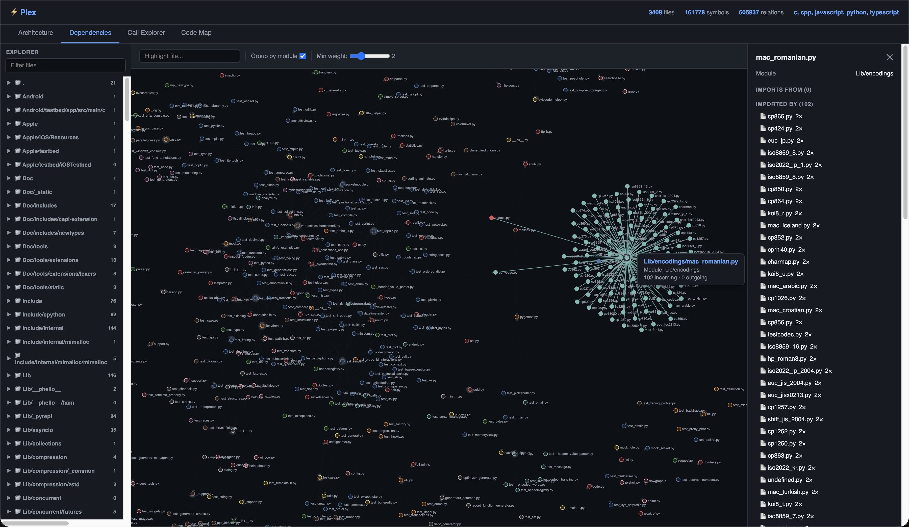
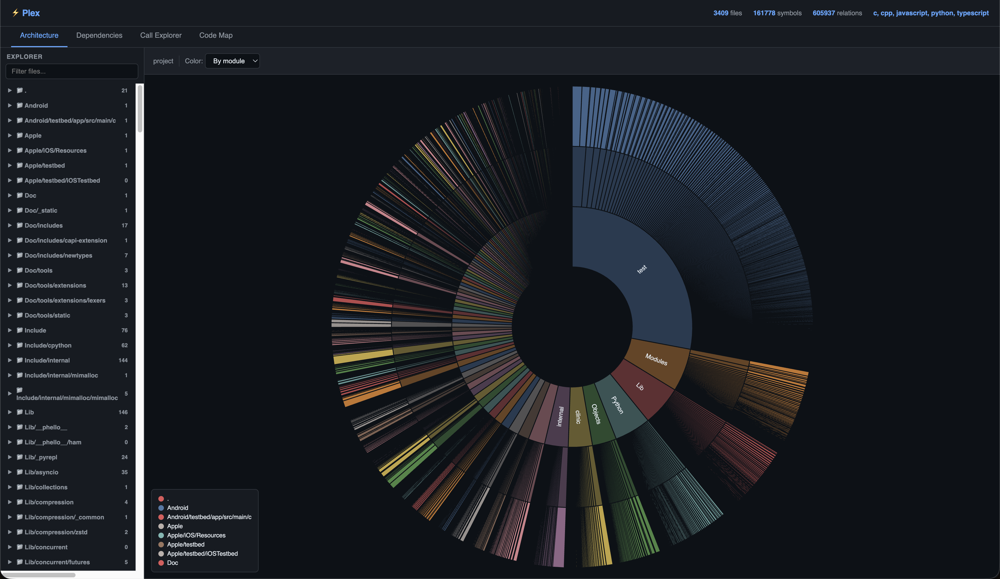
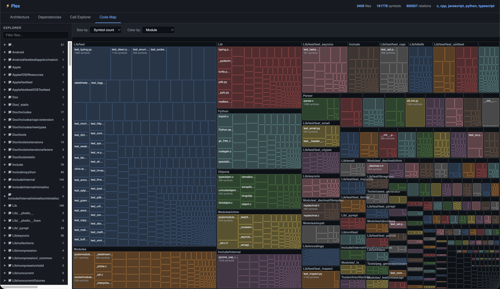

# plex

[](https://marketplace.visualstudio.com/items?itemName=plex-code.vscode-plex)

Local code intelligence engine. Single Rust binary that indexes a codebase into a queryable knowledge graph (symbols, call chains, inheritance, cross-file references) with hybrid semantic and full-text search. Plugs into AI agents via MCP, ships with a VS Code extension and an interactive visualization server.

No API keys. No cloud. Nothing leaves your machine.

<table>
  <tr>
    <td><a href="static/min_weight_2_dependencies_grouped_by_module_picture_of_plex_cpython_code_base.png"></a></td>
    <td><a href="static/cpython_architecture_graph_screenshot.png"></a></td>
    <td><a href="static/min_weight_1_dependencies_by_module_picture_of_plex_cpython_code_base.png"></a></td>
    <td><a href="static/code_map_by_module.png"></a></td>
  </tr>
  <tr>
    <td align="center"><sub>Module dependencies</sub></td>
    <td align="center"><sub>Architecture sunburst</sub></td>
    <td align="center"><sub>Dependency graph</sub></td>
    <td align="center"><sub>Code map</sub></td>
  </tr>
</table>

<p align="center"><sub>CPython indexed by plex. 3,409 files, 161K symbols, 605K relations.</sub></p>

## Install

**Homebrew** (macOS / Linux):
```bash
brew install abdoulrasheed/tap/plex
```

**Download binary** from [GitHub Releases](https://github.com/abdoulrasheed/plex/releases):
```bash
# macOS (Apple Silicon)
curl -L https://github.com/abdoulrasheed/plex/releases/latest/download/plex-darwin-arm64.tar.gz | tar xz
sudo mv plex /usr/local/bin/

# Linux (x64)
curl -L https://github.com/abdoulrasheed/plex/releases/latest/download/plex-linux-x64.tar.gz | tar xz
sudo mv plex /usr/local/bin/
```

**Build from source** (requires Rust 1.70+):
```bash
cargo build --release
ln -sf "$(pwd)/target/release/plex" /usr/local/bin/plex
```

The embedding model (~22 MB, quantized) is fetched on first run.

## Usage

```bash
plex index .                                  # index current directory
plex index . --no-embed                       # skip embeddings, text search only
plex search "payment processing" -p .         # hybrid semantic + text search
plex calls handle_request -p .                # forward call graph
plex calls handle_request -p . --callers      # reverse call graph
plex symbols src/main.rs -p . --json          # symbols in a file
plex stats .                                  # index summary
plex serve .                                  # visualization dashboard at :7777
plex mcp .                                    # start MCP server (stdio)
```

## MCP

plex speaks [Model Context Protocol](https://modelcontextprotocol.io/) over stdio. Any compatible client (Cursor, VS Code Copilot, Claude Desktop) gets structured access to the full codebase graph.

<details>
<summary><strong>Cursor</strong> <code>.cursor/mcp.json</code></summary>

```json
{
  "mcpServers": {
    "plex": {
      "command": "plex",
      "args": ["mcp"],
      "cwd": "/absolute/path/to/project"
    }
  }
}
```
</details>

<details>
<summary><strong>VS Code Copilot</strong> <code>.vscode/mcp.json</code></summary>

```json
{
  "servers": {
    "plex": {
      "type": "stdio",
      "command": "plex",
      "args": ["mcp"],
      "cwd": "${workspaceFolder}"
    }
  }
}
```
</details>

<details>
<summary><strong>Claude Desktop</strong></summary>

```json
{
  "mcpServers": {
    "plex": {
      "command": "plex",
      "args": ["mcp"],
      "cwd": "/absolute/path/to/project"
    }
  }
}
```
</details>

**Tools:** `search` · `get_symbol` · `get_callers` · `get_callees` · `get_inheritance` · `find_implementations` · `get_file_symbols` · `get_project_structure` · `get_references`

## VS Code extension

Install from the [VS Code Marketplace](https://marketplace.visualstudio.com/items?itemName=plex-code.vscode-plex) or search **"Plex — Code Intelligence"** in the Extensions panel.

Provides a symbol tree, search panel, call graph view, and a webview dashboard. Auto-indexes on save and generates MCP config on activation.

To build from source:

```bash
cd vscode-plex && npm install && npm run compile
npx @vscode/vsce package
code --install-extension vscode-plex-0.1.0.vsix
```

## Supported languages

Python · JavaScript · TypeScript · Rust · Go · Java · C · C++

## Performance

Tested on CPython:

| | |
|---|---|
| Files | 3,409 |
| Symbols | 161,778 |
| Relations | 605,937 |
| Embeddings | 127,504 |
| Index (with embeddings) | ~7 min |
| Index (no embeddings) | ~8 s |
| Binary | 34 MB |

## License

MIT
